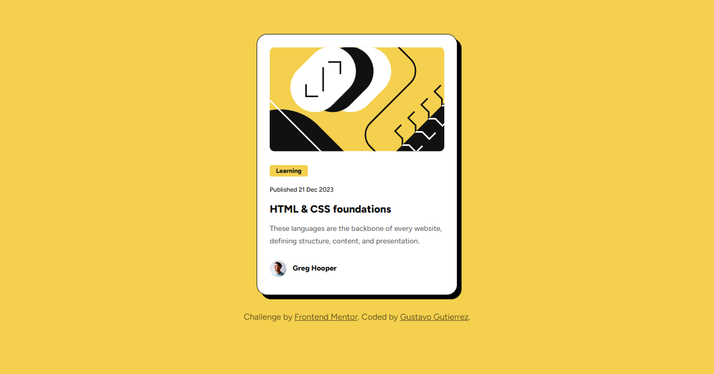

# Frontend Mentor - Blog preview card solution

This is a solution to the [Blog preview card challenge on Frontend Mentor](https://www.frontendmentor.io/challenges/blog-preview-card-ckPaj01IcS). Frontend Mentor challenges help you improve your coding skills by building realistic projects.

## Table of contents

- [Overview](#overview)
  - [The challenge](#the-challenge)
  - [Screenshot](#screenshot)
  - [Links](#links)
- [My process](#my-process)
  - [Built with](#built-with)
  - [What I learned](#what-i-learned)
  - [Continued development](#continued-development)
  - [Useful resources](#useful-resources)
- [Author](#author)

## Overview

### The challenge

Users should be able to:

- See hover and focus states for all interactive elements on the page

### Screenshot



### Links

- Solution URL: [Github repository](https://github.com/gustavo2023/blog-preview-cardhttps://your-solution-url.com)
- Live Site URL: [Blog preview card](https://gustavo2023.github.io/blog-preview-card/)

## My process

### Built with

- Semantic HTML5 markup
- CSS custom properties
- Flexbox
- Mobile-first workflow

### What I learned

- I learned about using variables in CSS.
- Learned about the Flexible Box Layout Module in order to make it easier to structure the items.
- Media queries to adjust the size of components based on the screen size.
- Use transitions and pseudo-classes in order to add certain effects to specific components.

In order to add the hovering animation required for this project I used a pseudo class selector:

```css
.card:hover {
  box-shadow: 0.875rem 0.875rem 0 0 #000;
}

.card:hover .title {
  color: var(--color-yellow);
}
```

### Continued development

For future projects I would like to understand media queries better and the different uses of flexbox.
I also think that from now I want to try experimenting with different kinds of transitions and animations for all kinds of components and elements.

### Useful resources

- [W3Schools Tutorial](https://www.w3schools.com/css/css3_flexbox.asp) - This helped me have a basic understanding of flexbox.
- [mdn web docs](https://developer.mozilla.org/en-US/docs/Web/CSS/transition) - This is an amazing documentation site for CSS that helped me see how transitions work.

## Author

- Frontend Mentor - [@gustavo2023](https://www.frontendmentor.io/profile/gustavo2023)
